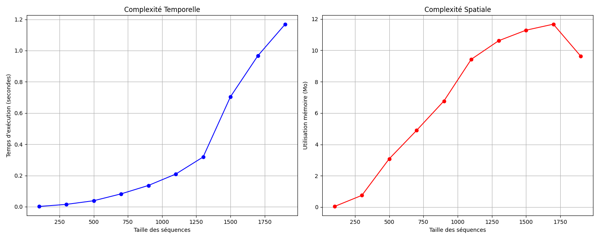

# Implémentation Parallèle de l'Algorithme BLAST en Python

Ce projet, réalisé dans le cadre du module "Architecture et Calcul Parallèle", présente l'implémentation et l'analyse de performance d'une version parallélisée de l'algorithme BLAST (Basic Local Alignment Search Tool).

L'objectif principal est d'accélérer l'exécution de BLAST, un algorithme essentiel en bio-informatique, en exploitant les architectures de processeurs multi-cœurs à l'aide de la bibliothèque `multiprocessing` de Python.

## 📊 Analyse de Performance

Une analyse comparative a été menée entre les versions séquentielle et parallèle de l'algorithme. Les résultats montrent une **accélération (speedup) significative de 2.90x** sur 8 processus, avec une efficacité de 36.22%. L'étape la plus coûteuse, l'extension des alignements, a été accélérée de **4.33x**.

### Complexité Temporelle et Spatiale (Version Séquentielle)

L'analyse de la version séquentielle a confirmé une complexité temporelle proche de **O(n²)** et une complexité spatiale proche de **O(n)**, ce qui est cohérent avec la théorie de BLAST.


_Graphiques montrant la complexité temporelle (gauche) et spatiale (droite) de l'implémentation séquentielle._

## 🛠️ Modèle de Parallélisation

Après une analyse par *profiling* (`cProfile`) pour identifier les goulots d'étranglement, un modèle de pipeline en 3 étapes a été conçu et implémenté :

1.  **Création de l'Index (25% des cœurs) :** La séquence "sujet" est découpée en `chunks` et l'index des mots est construit en parallèle.
2.  **Recherche des Seeds (25% des cœurs) :** La séquence "requête" est également découpée pour rechercher les correspondances initiales (seeds) dans l'index parallèlement.
3.  **Extension des Alignements (50% des cœurs) :** C'est l'étape la plus coûteuse en calcul. Les seeds trouvées sont distribuées entre plusieurs processus pour étendre et scorer les alignements simultanément.

La communication entre les processus est gérée par un système de files d'attente (`multiprocessing.Queue`) pour assurer un flux de données efficace.

## 🚀 Scripts et Utilisation

Le projet est structuré en plusieurs scripts pour l'implémentation, l'analyse et la comparaison.

- **`src/sequential_blast.py`** : L'implémentation de référence de BLAST, purement séquentielle.
- **`src/parallel_blast.py`** : L'implémentation parallèle qui compare les performances avec la version séquentielle.
- **`src/profiling_analysis.py`** : Script utilisé pour profiler la version séquentielle et identifier les goulots d'étranglement.
- **`src/blast-sequentiel-temp.py` & `src/blast-sequentiel-spat.py`** : Scripts dédiés à l'analyse empirique des complexités.

### Comment l'Exécuter

1.  **Clonez le dépôt :**
    ```bash
    git clone https://github.com/VOTRE_NOM_UTILISATEUR/Parallel-BLAST-Implementation.git
    cd Parallel-BLAST-Implementation
    ```

2.  **Installez les dépendances :**
    ```bash
    pip install -r requirements.txt
    ```

3.  **Exécutez le script principal de comparaison :**
    ```bash
    python src/parallel_blast.py
    ```
    Le script générera des séquences aléatoires et affichera une comparaison détaillée des temps d'exécution entre les versions séquentielle et parallèle.

## 📚 Documents de Référence
- **[Rapport Complet du Projet](./Rapport_Paralleisation_BLAST.pdf)** : Ce document contient la présentation détaillée de BLAST, l'analyse de complexité, le modèle de parallélisation, les résultats de performance et la conclusion.
- **[Énoncé du Projet](./Enonce_Projet_ACP.pdf)** : Le cahier des charges original.